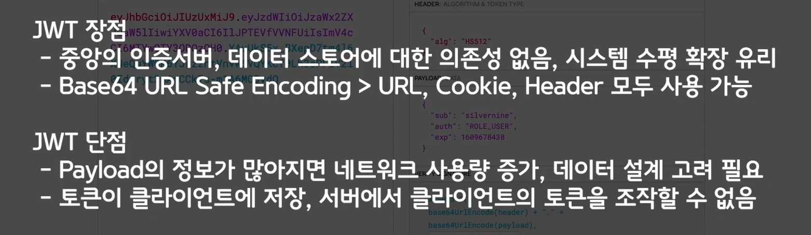

#### JWT 구성

- header
- payload
- signature




get mapping  실행하면 Unauthorized 에러남


@EnableWebSecurity

implement

```java
.authorizeRequests()
                .antMatchers("/api/hello").permitAll() // 모든 객체
                .anyRequest().authenticated(); //나머지는 인증이 필요함
```

ㅠㅠ
