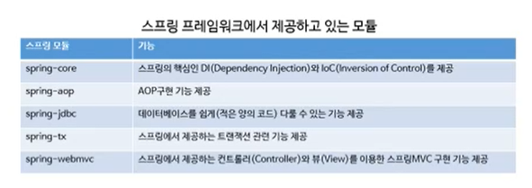
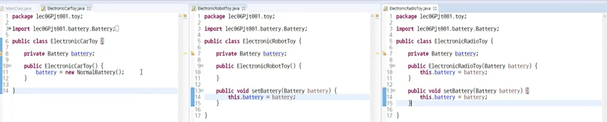
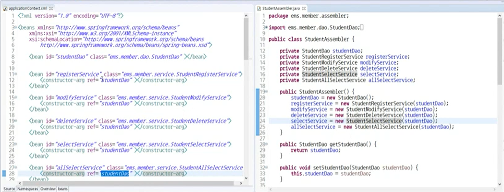
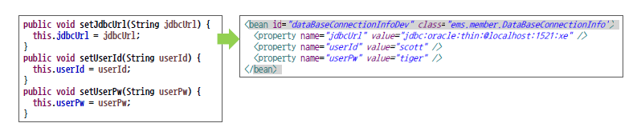
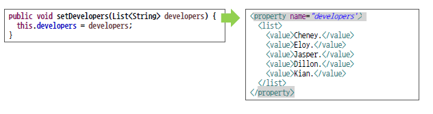
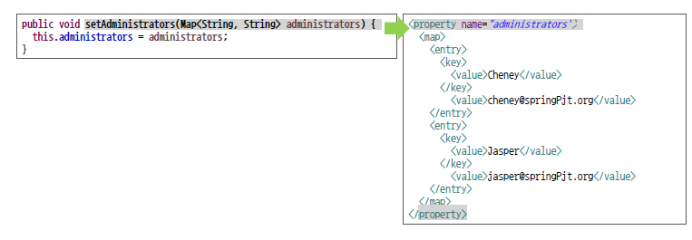
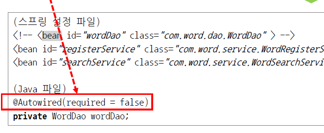
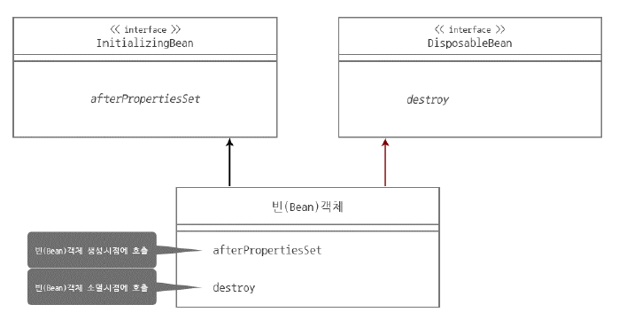
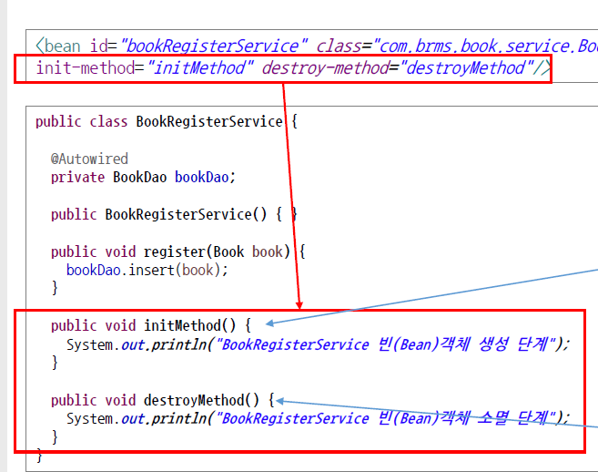
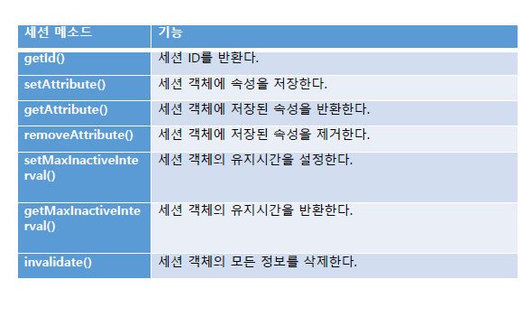

### 스프링 프레임워크

1. 스프링 프레임워크

- DI(주입), AOP(관점지향), MVC, JDBC 제공
- 프레임워크는 틀, 추상적으로 정의된 틀

2. 스프링 프레임워크 모듈

   

   - spring-core
   - spring-aop
   - spriing-jdbc
   - spring-tx
   - spring-webmvc
   - 모듈에 대한 의존설정을 개발 프로젝트에 XML 파일등을 이용해 개발자가 직접 하면됨

3. 스프링 컨테이너 IoC

   - 스프링에서 객체를 생성하고 조립하는 컨테이너, 컨테이너를 통해 생성된 객체를 빈


### 개발 환경 구축

- 자동완성 : https://www.dante2k.com/533


### 스프링 프로젝트 생성

1. 프로젝트 생성 : maven

   - grorpid : 자바 버전
   - artifactid : 모듈이름

2. pom.xml 작성

3. project- src main- java/resource 파일 생성됨

   - java 파일 - 기능구현
   - resource - 보조 역할 파일, 빌드, 개발환경 파일 / 스프링 설정파일(XML), 프로퍼티 파일 관리됨

4. 폴더 및 pom.xml 파일 이해

   - 메이븐 설정파일로 라이브러리 연결해주고, 빌드 연결해줌
   - 외부 라이브러리를 사용할수있게해줌

   - porm.xml 파일에 추가해주기

   ```xml
     	<dependencies>
   		<dependency>
   			<groupId>org.springframework</groupId>
   			<artifactId>spring-context</artifactId>
   			<version>4.1.0.RELEASE</version>
   		</dependency>
   	</dependencies>
   	<build>
   		<plugins>
   			<plugin>
   				<artifactId>maven-compiler-plugin</artifactId>
   				<version>3.1</version>
   				<configuration>
   					<source>1.8</source>
   					<target>1.8</target>
   					<encoding>utf-8</encoding>
   				</configuration>
   			</plugin>
   		</plugins>
   	</build>
   ```

   

### 처음해보는 스프링 프로젝트

1. Java 파일을 이용한 프로젝트 실행

   - resource/applicationContext : 컨테이너 안 객체 모아두는데(Ioc), 컨테이너의 객체(bin)을 만들어주는 역할 

2. 우선따라해보는 스프링 프로젝트

   - xml과 java 파일
   - resouce 밑에 xml 파일 생성

   ```xml
   <?xml version="1.0" encoding="UTF-8"?>
   
   <beans xsi:schemaLocation="http://www.springframework.org/schema/beans http://www.springframework.org/schema/beans/spring-beans.xsd" 
   	xmlns:xsi="http://www.w3.org/2001/XMLSchema-instance" 
   	xmlns="http://www.springframework.org/schema/beans">
   
   	<bean class="testPjt01.TranspotationWalk" id="tWalk"/>
   	
   </beans>
   ```

   

   - java 파일 수정

   ```java
   package testPjt01;
   
   import org.springframework.context.support.GenericApplicationContext;
   import org.springframework.context.support.GenericXmlApplicationContext;
   
   public class MainClass {
   	
   	public static void main(String[] args) {
   		
   		// 기존방식
   //		TranspotationWalk transportationWalk = new TranspotationWalk();
   //		transportationWalk.move();
   		
   		// 컨테이너를 생성
   		GenericXmlApplicationContext ctx = new GenericXmlApplicationContext("classpath:applicaitonContext.xml"); 
   		
   		// 객체(Bean)을 가져옴
   		TranspotationWalk transportationWalk = ctx.getBean("tWalk", TranspotationWalk.class);
   		transportationWalk.move();
   		
   		ctx.close();
   	}
   ```

   

### 또다른 프로젝트 생성 방법

로컬에서 만들어서 import 하기

1. 폴더(java.resouces)와 파일(porm.xml) 만들기
2. 이클립스에서 임포트하기
3. 나머지 과정은 동일


### DI(Dependency injection)

방법 중 하나

1. DI 란

   - 배터리 일체형, 배터리 분리형(처음샀을때 없는거, 있는거, 생성자 차이)
   - 배터리가 있어야 프로그램이 완성된다는 의미
   - 객체를 만들어서 외부에서 넣어주는 것?
   - 생성자, 세터로 의존성 주입가능

   

   - 스프링 컨테이너에서 빈객체 호출 가능

   

   - 생성자를 xml 파일에 넣어줌


### 다양한 의존 객체 주입

1. 생성자를 이용

   - `<constructor-arg ref = '참조 아이디'><constructor-arg>`태그 이용

2. setter를 이용

   

   - set을 떼고 소문자로 바꿔서 property 타입으로

3. list 타입

   

   - list 타입 넣는 방법 : 리스트 태그안에 밸류

4. map 타입

   

   - map - entry태크 안에 key, value 태그 감싸서 넣어주기


### 스프링 설정 파일 분리

하나의 xml 파일에 작성하면 가독성, 관리 문제가 생길 수 있음

1. 스프링 설정 파일 분리

   - 기능별로 분리
   - 자바 파일에서 문자열 배열 형태로 작성해 넣어줌 : `String[] appCtxs = {"Classpath:appCtx1.xml", "Classpath:appCtx1.xm2"}` , `GenericSmlApplicationContext ctx = new GenericSmlApplicationContext(appCtxs)`
   - 컨테이너 로그에 사용한 xml 파일 확인가능
   - 배열로 로드하는 방법을 자주 사용함

   

   - xml 파일에서 import 가능 : `<import resource="classpath:appCtx2.xml"/>`
   - 임포트하면 하나만 가져와서 사용할 수 있음

   

   - 메인 메소드 여러개 있으면 JVM이 물어봄
   - 바로 실행하고 싶으면 마우스 올리고 실행하면 됨

2. 빈의 범위

   - 싱글톤 : 같은 데이터 타입이면 동일한 객체만 반환됨(디폴트)
   - 프로토타입 : 싱글톤의 반대 개념, 빈 객체 정의시에 scope 속성을 명시해주면됨 `scope="prototype"` 다른 공간에 객체 생성되어 구별됨


### 의존 객체 자동 주입

의존 객체를 자동으로 주입하는 방법

1. 의존객체 자동 주입이란?
   - 태그를 명시하지 않아도 스프링 컨테이너가 자동으로 객체를 찾아서 주입
   - `@Aurowired` `@resource`를 사용
2. `@Autowired` : 객체의 `타입`이 일치하는 객체를 자동으로 주입
   - `<context:annotation-config/>`과 클래스파일을 xml 파일에 추가해줘야함.
   - 생성자엔 걍 쓰면 되는데, 파라미터 있는 생성자가 있다면 default 생성자 추가해줘야함
3. `@resource`
   - 객체의 이름이 같은지 확인해 주입
   - 생성자에는 못씀

찾는 원리 / 사용의 차이


### 의존 객체 선택

다수의 빈 객체에서 객체의 대상이 어떻게 선택되는지 살펴봄

1. 의존객체 선택

   - 동일 객체가 2개 이상이면 자동 주입 대상 객체를 판단하지 못해 Exception 발생 -> `Qualifier`을 사용해 해결 가능
   - value와 이름을 매칭시켜줌
   - 타입과 이름이 같으면 동일 이름만 자동 주입되긴함(좋은 방법은 아님)

   

2. 의존객체 자동 주입 체크

   - 의존객체가 없을때 exceoption 발생을 중지 시킬 수 있음(거의 안쓰임)

   

3. `@inject`

   - required를 지원하지 않음. autowired와 동일하다고 보면 됨
   - `@Name(value="아이디명")` 어노테이션으로 구별 가능(조금 더 간편)

?? required가 뭐야??

?? 동일하면 왜써??


11강 생명주기(Life Cycle)

스프링 컨테이너와 빈 객체의 생명주기

인터페이스 방법, init, destory 사용하는 두가지 방법 있음

1. 스프링 컨테이너 생명주기

   - 스프링 컨테이너가 생명되며 Bean 객체도 생성되고 의존성 가지기 때문에 생성 시점 같음
   - close() 를 이용해 소멸, 빈객체도 사동 소멸

2. Bean 객체 

   - 스프링 컨테이너의 생명주기와 같다
   - 특정 빈 생성 소멸에 작동하고 싶으면 

   

   - implement로 생성, 소멸 인터페이스 받아와야함

3. init-method, destory-method 속성

   - 각 빈의 속성 사용

   

lec11 project 파일에서 예시 확인 가능 : 도서관 책대여 시스템

디비 없어서 map 자료형 이용

DB 인증 절차가 필요할때, 자원해제할때 등에 사용


### 어노테이션을 이용한 스프링 설정-1

XML을 이용한 스프링 설정파일 제작을 Java 파일로 제작하는 방법

자바파일을 분리하고 연결해서 사용하는 방법

1. XML 파일을 Java파일로 변경
   - Java파일에서 Anotion 이용해 조작
   - lec12001파일 학사 사이트 파일
   - `@configuration`을 이용해 컨테이너 생성 가능하게 함
   - `@bean`을 달고 메소드를 이용해 Bean객체 생성하고 return 
   - 다른객체 집어넣어 반환형이 데이터 타입, 메소드 이름이 id 역할
   - 객체 만들고 속성 저장 property 표현
   - 리스트타입 ArrayList, 맵태그 HashMap 데이터 타입 사용
   - `AnnotationConfigApplicationContext`로 메일 클래스와 연결 
2. Java 파일 분리
   - 유지보수를 위해 분리, 기능별로 분리
   - 데이터베이스, 서버, BD, 유틸리티와 같이 분리
   - 임포트 된거중에 지워주는 단축어? 컨트롤 O?
   - 다른 파일을 참조하기 위해 객체를 만들고 Autowired하여 자동 주입
   - 다른 자바파일을 컨테이너 하나에 모으기 위해 main 파일에 배열 형식으로 나열해줌
3. @import 어노테이션
   - `@import({memberconfig.class, ~.class})` 처럼 임포트해 하나로 작성가능


### 웹 프로그래밍 설계 모델

스프링 MVC 프레임 워크 기반 웹 프로그래밍 구조

1. 웹 프로그래밍 구출 설계 모델
   - M1, M2 방식으로 구분(모델1, 모델2)
   - M1 : html 파일에 다 적기
     - 개발속도는 빠르지만 유지보수 어려움
   - M2: 컨트롤러 서비스 다우 뷰 로 모듈화
     - MVC를 기반으로 함
     - 유지보수 쉬움
2. 스프링 MVC 프레임워크 설계구조
   - 핸들러 맵핑이 알맞은 컨트롤러를 선택해줌
   - 가장 적합한 것 adapter이 알맞은 메소드 연결
   - 뷰를 선택, 뷰로 표현, JSP가 응답
3. Dispatcher Servlet
   - web.xml (JSP, Servlet 공식문서 참고)
   - 서블릿 등록, 스프링 설정파일 연결해 컨테이너 생성
   - xml을 지정하지 않으면 별칭을 사용함
4. 컨트롤러 객체 @Controller
   - 컨트롤러를 사용하기 위해 Xml 파일에 `annotationl driven` 추가, `@Controller` 작성 후 추가
5. 컨트롤러 객체 @RequestMapping
   - 맵핑을 이용해 실행될 수 있게 함
6. 컨트롤러 객체 모델타입 파라미터
7. View 객체
   - 서블릿이 적절한 뷰를 찾음
8. 전체적 웹 프로그래밍 구조

Servlet은 신경 안써도 됨, 컨트롤러, View는 구현


### 스프링 MVC 웹서비스

1. 웹서버(Tomcat 다운로드)
   - ?? 톰캣으로도 된느데 다른거도 된다고?? 톰켓이 하는일이 뭐징
   - D드라이브 거기에 다운하면 될듯
   - 버전맞추고 파일경로 설정하면 연동
   - 설정 서버 로케이션 두번쨰, 서버옷션도 2, 3, 선택, 포트를 8080(오라클 충돌 방지를 위해 변경 ?? 오라클이 8090인가) 사버창 왼쪽 4번째 버튼으로 동기화, 실행해보면 고양이 보임
   - 아이피는 127.0.0.1
2. 톰캣과 이클립스 연동
3. 이클립스에 STS(Spring Tool Suit)설치
   - 해당 플러그인이 기본적인 일들을 해줌 help-marketplace에서 설치 가능
4. STS를 이용한 웹 프로젝트 생성
   - spring MVC 프로젝트 설정
   - 이름과 페키지명 지정
   - 런서버로 실행
5. 스프링 MVC 프레임워크를 이용한 웹프로젝트 분석


### 스프링 MVC 웹 서비스 2

 	1. 프로젝트 전체 구조
 	 - webapp 웹과 관련된 파일
 	   - html, css, js
 	   - 스프링 설정파일(servlet-context.xml : 스프링 컨테이너 생성)
 	2. Web.xml
 	3. DispatherServlet
 	4. servlet-context.xml
 	5. controller
 	6. view


### STS를 이용하지 않은 웹 프로젝트

1. 스프링 MVC 웹 어플리케이션 제작을 위한 폴더 생성

   - 경로 맞춰서 폴더 생성

2. pom.xml 및 이클립스 import

   - 메모장으로 pom.xml 파일 생성

3. web.xml 작성

   - 패키지도 생성

4. 스프링 설정파일 작성

   - servlet-context.xml 파일

5. root-context.xml 작성

6. 컨트롤러와 뷰 작성

   - `@RequestMapping`
   - `model.addAttribute("key")`

   - `${key}`로 가져와서 사용

7. 실행


### Service & Dao 객체 구현

1. 웹 어플리케이션 준비
2. 한글처리
   - web.xml 파일에 filter 코드를 추가해 사용
3. 서비스객체구현 : 3가지 방법
   - 순수 자바
   - 설정파일을 이용해 의존객체 투입
   - `@Service` 어노테이션 부착(Component, Repository 도 가능, 이를을 추가해 부착할수도 있음)
4. DAO 객체 구현
   - 어노테이션


### Controller 객체 구현

컨트롤러 URL 맵핑, 파라미터 처리 방법

1. 웹 어플리케이션 준비
2. `@RequestMapping`을 이용한 URL Mapping
   - POST 방법은 명시, value가 하나일때는 그냥 값만 적어도됨
   - 명시안했으면 이름 같은거 실행해줌
   - action과 value이름을 맞춰줘야함
   - 공통된 요청데이터 묶기 가능
   - 클래스 맨 위에 이퀘스트메핑 어노테이션을 달면 됨
3. 요청 파라미터
   - 서블릿 리퀘스트 객체로 받음
     - `HttpServletRequest request`로 받음
   - 어노테이션으로도 받을 수 있음
     - `@RequestParam("memId") String memId`
     - required와 defaultValue 속성으로 값 넘어오지 않았을때 처리 가능
   - 커맨드 객체 이용(가장 많이 사용, 코드 간결)
     - Member 객체에 정의되어있고 세터 게터가 있어 사용가능
     - 정의와 addAtribute를 사용하지 않아도 됨
     - jsp에서 토드 이용해 접근 가능


### Controller 객체 구현 2

1. `@ModelAttribute`
   - `@ModelAttribute("mem")` 으로 jsp에서 mem.memId로 접근 가능
   - 뷰에서 사용할 닉네임 설정해서 접근 가능
   - 메소드 바깥에 정의해놓으면 연관된 다른 메소드에서 사용 가능(서버타임)
2. 커맨드 객체 프로퍼티 데이터 타입
   - 적절히 정의
   - 중첩커멘드 : 리스트 사용
3. Model & ModelAndView
   - Model : 부에 데이터만 전달
   - ModelAndView : 데이터와 뷰의 이름을 함께 전달
     - ???? 리턴은 그럼 뭐해줌


### 세션, 쿠키

클라이언트와 서버의 연결 유지 방법

1. 세션과 쿠키
   - 클라이언트와 서버를 연결
   - HTTP 프로토콜 ??
   - connectionless Protocol : 필요할떄만 연결
     - 서버 자원을 효율적으로 사용하기위함
     - 로그인이나 장바구니 결제 같은데서 문제가 발생 -> 세션(서버)과 쿠키(클라이언트)로 관계 유지
2. HttpServletRequest 이용 세선 사용
   - 파라미터 ->  getsession, session -> setAttribute(키:벨류)
3. HttpSession 이용한 세션 사용
   - 세션 없는 방법에 차이
   - 리퀘스트 없이 바로 받음
   - 파라미터 ->  set으로 추가

4. 세션 삭제

   - 세션 저장 속성이 필요 없을때
   - `session.invalidate()`

5. 주요 메소드

   

6. 쿠키 : 사용자 로컬 컴퓨터에 정보남은

   - httpServletResponse
   - Cookie 객체 생성
   - setMaxAge("시간설정")
   - `@coovieValue(value="벨류", required=지정안해도됨)` 가져오는 방법

세션이 보안에 좋긴함 / 쿠키는 서버 부하를 줄이기 좋음


### 리다이렉트, 인터셉트

컨드롤러에서 뷰를 분기, 실행 전후에 특정작업

1. 리다이렉트 : 지금 페이지에서 특정 페이지로 전환, 분기 가능
   - `return "redirect:/"`
2. 인터셉트 : 리다이랙트 할일이 너무 많을때
   - 디스패쳐랑 핸들러,뷰 사이에 끼임
   - 원래 인터페이스인데 스프링에서 상속받아 사용가능 ??? 맞나
   - 인터셉터를 스프링 설정파일에 매핑해주면됨 / 필요없는건 제외하는 방법도 가능


### 데이터베이스

1. 오라클 다운로드
2. 오라클 설치
   - 아이디, 비번 기억하기 system, oracle로 설정
3. 계정생성
   - sqlplus
   - 계정 만들고, 권한주기, 없애기도 가능
4. SQL developer
   - 첨에 자바 경로 지정


### JDBC

Java 언어를 사용해 DB와 연결

1. 오라클에 추가해보기
2. JDBC
   - 드라이버 로딩
   - DB 연결
   - SQL 작성 및 전송
   - 자원해제
   - 예외처리도 해야함
   - 중복코드가 계속 발생 -> 스프링에서 JDBC 탬플릿을 제공


### JDBC template

1. JDBC의 단점을 보완한 JDBC template
   - 개발자가 본연의 일만 할 수 있음
   - 동일 작업을 안해도됨
2. DataSource 클래스
   - 스프링과 c3p0
   - 디비 연결과 관련된 정보를 가지고잇음
   - pom 파일에 러파지토리에서 가져올 파일 추가
   - 데이터 소스에 따라 API가 달라질수 있음
   - 입력클래스 방법이 3가지..
   - 쿼리를 날리는 방법 4가지..


### 커넥션풀

데이터베이스 연결을 미리 준비해놓고 사용하는 방법(서버 부하 줄이기)

1. c3p0 모듈의 ComboPooledDataSource
   - 예외처리를 해줘야 함
2. 스프링 설정파일을 이용한 DataSource
   - xml에 빈 객체 만들어서 autowired 사용해서 사용
