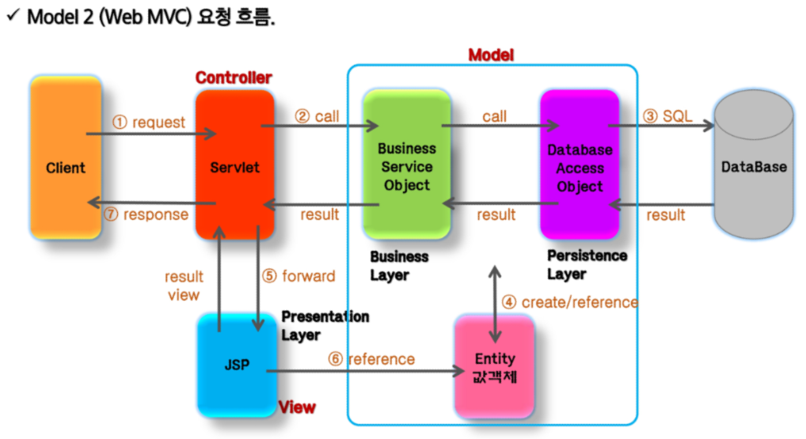
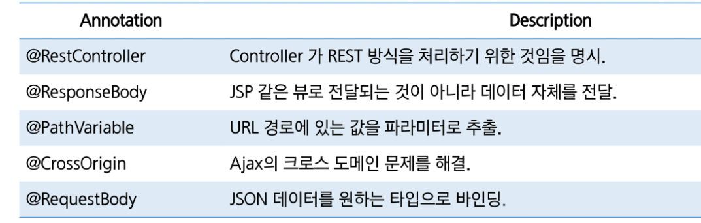

### DI

---

### WEBMVC

---

MVC pattern

- 변경이 다른 컴포넌트에 영향 미치지 않음
- 결합성이 낮아 프로그램 수정 용이
- 화면과 비즈니스 로직 분리
- 확장성
- 공동작업 용이하고 유지보수성 좋음

- Model
- View
- Controller

- 요청 흐름

  

  

- spring MVC 구성요소

  - DispatcherServlet

    - 클라이언트 요청 전달받음
    - 컨트롤러에게 요청 전달, 리턴값을 view에게 전달

  - HandlerMapping

    - 클라이언트 URL 매핑
    - URL과 요청 정보 기준으로 핸들러 객체 결정

  - Controller

    - 요청 처리 후 모델 호출하고 DispatcherServlet에 알려줌

  - ModelAndView

    - 컨트롤러가 처리한 데이터 및 화면 정보 보유 객체

  - ViewResolver

    - 컨트롤러가 리턴한 뷰 이름 기반으로 뷰 결정

  - View

    - 응답화면 생성

    

### MyBatis

---

### REST API

---

HTTP URI를 통해 제어할 자원을 명시하고 HTTP Method를 통해 해당 자원을 제어하는 명령을 내리는 방식의 아키텍처

### Spring Boot

---

- Dependency
  - spring boot devtolls
  - spring web